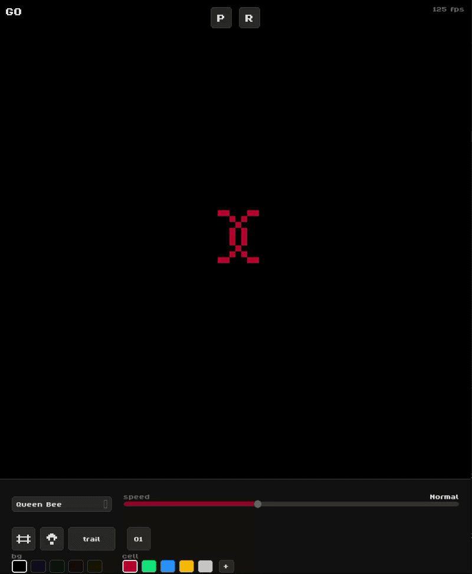

# Conway's Game Of Life

a recreation of John Conway's mathematical game, the Game of Life using pygame.

# Features

**Drawing and editing**
Left click to place cells, right click to erase, and hold to drag and paint across the grid. All edits are tracked in history so you can step back and undo anything.

**35+ built-in patterns**
A categorized dropdown with over 35 classic patterns.

**Customizable Simulation Speed**
Drag the speed slider anywhere from 0.25x to 8x while the simulation is running to control how fast generations tick by.

**Cell trail effect**
Toggleable trail that fades out recently dead cells over a few generations.

**Custom themes**
Dark and light mode plus 5 background and 5 cell color presets.

**Playback and history**
The full simulation history is stored in memory so you can play, pause, and step forward or backward through every generation all the way back to zero.

**Binary view**
The 01 button opens a scrollable window showing the raw grid as 0s and 1s, white for live cells and dark gray for dead ones, so you can see exactly what the simulation looks like as data.
